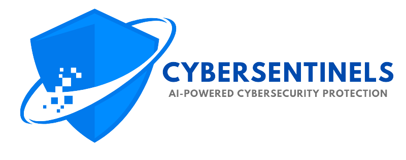

# CyberSentinels

 <!-- Updated logo path -->

**Securing the Digital World with AI-Powered Fraud Detection & Privacy Protection**

---

## 🌟 Introduction

CyberSentinels is an AI-powered cybersecurity platform designed to make the digital world safer by preventing fraud, deepfakes, and privacy breaches in real-time. Our mission is to provide cutting-edge solutions that protect users from evolving digital threats, ensuring a secure and private online experience.

### Key Features:
- ✅ **Real-time fraud detection**
- ✅ **AI-powered deepfake prevention**
- ✅ **Screenshot blocking for privacy**
- ✅ **Scam call & message filtering**
- ✅ **Social media content removal**

---

## 🚀 Vision & Mission

### Vision:
"To make the digital world safer with AI-driven cybersecurity that prevents fraud, deepfakes, and privacy breaches in real-time."

### Mission:
- Detect & prevent fraud before it happens.
- Stop deepfakes & AI-driven scams.
- Protect user privacy by blocking unauthorized access.
- Ensure real-time security with AI-powered alerts.

---

## 🔍 Why CyberSentinels?

CyberSentinels is your AI-powered digital shield that:
- Detects scams & deepfakes before they harm users.
- Blocks unauthorized screenshots & hidden surveillance.
- Helps remove leaked content from social media.
- Provides real-time security insights for ultimate protection.

**CyberSentinels – Your AI Guardian for Digital Safety!**

---

## 🛠️ Tech Stack

CyberSentinels is built using the following technologies:

### Frontend:
-  **ReactJS**: A powerful JavaScript library for building user interfaces.

### Backend:
-  **Node.js**: A runtime environment for server-side development.
-  **JWT (JSON Web Tokens)**: For secure user authentication and authorization.

### Database:
-  **MongoDB**: A NoSQL database for flexible and scalable data storage.

### AI/ML:
-  **Python**: For developing and deploying AI and machine learning models.

---

## 📚 Documentation

Comprehensive documentation is available to help you understand, set up, and contribute to the project. Check out the [Documentation](./Documentation) folder for details.

---

## 🛠️ Setup & Automation

### CI/CD Pipeline
We use a CI/CD pipeline to automate testing and deployment, ensuring seamless integration and delivery of updates.

### Issue Tracking
GitHub issue templates are available for reporting bugs and requesting new features. Use the following templates:
- [Bug Report](.github/ISSUE_TEMPLATE/bug_report.md)
- [Feature Request](.github/ISSUE_TEMPLATE/feature_request.md)

---

## 📄 License

This project is licensed under the MIT License. See the [LICENSE](./LICENSE) file for details.

---

## 📧 Contact

For inquiries or support, please reach out to us at:
- **Email:** support@cybersentinels.com
- **Website:** [www.cybersentinels.com]([https://www.cybersentinels.com](https://cybersentinelss.netlify.app/))

---

**CyberSentinels – Empowering a Safer Digital Future!**
